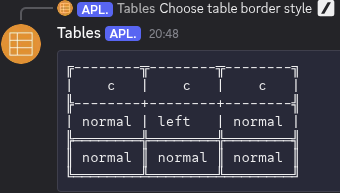

# TablesBot
Discord bot that let's user create tables with text alignment and different styles of borders.

## Libraries
Uses [D++](http://dpp.dev) for comunication with Discord and [p-ranav's tabulate](https://github.com/p-ranav/tabulate) to format table.

## Building
You need to make sure you install [D++](http://dpp.dev)(preferably as a DEB or RPM package, otherwise you need to adapt includes in ```tablesBot.cpp``` and ```meson.build```) and [Meson](https://mesonbuild.com/)
1. Clone repository
2. Add your bot token to ```keys/keys.h```
3. Run 
    ```meson setup builddir``` and
    ```meson compile -C builddir```
4. The binary will be located in ```builddir``` directory and named ```TablesBot```

## How to use it

### Simple table
Simple table uses default formatting and only takes values of cells as input.

#### Formatting cell data
Cell data uses following pattern:

    CELL1|CELL2

Where CELL1 and CELL2 are substituted with text inside of the cells.

To add a new row, add a new line. To add empty row, add empty line.

#### Example usage


### Formatted table
Formatted table allows for text alignment and border styling.

#### Choosing border style
Click button with desired style.

Available styles:

- Single border with pluses as corners(default)


- Double border


- Single border


- Single bold border


- Single rounded border


- Dotted border


#### Formatting cell data
Cell data uses following pattern:

    CELL1|CELL2

Where CELL1 and CELL2 are substituted with text inside of the cells.

To add a new row, add a new line. To add empty row, add empty line.

#### Text alignment
Text alignment data follows the following pattern:

- for cells:

    ```cell:x_coordinate:y_coordinate:l_or_c_or_r```

    Where:
    cell - is literal text you type
    x_coordinate - x coordinate of the cell, starts from the left, 1 is the first one 
    y_coordinate - y coordinate of the cell, starts from the top, 1 is the first one 
    l_or_c_or_r - ```l``` for left, ```c``` for center, ```r``` for right

- for rows and columns:

    ```row_or_column:number:l_or_c_or_r```

    Where:
    row_or_column - literal text you type, ```row``` or ```column``` depending what rule you want to specify
    number - number of the row/column, starting from the left/top, 1 is the first one
    l_or_c_or_r - ```l``` for left, ```c``` for center, ```r``` for right

#### Example usage





